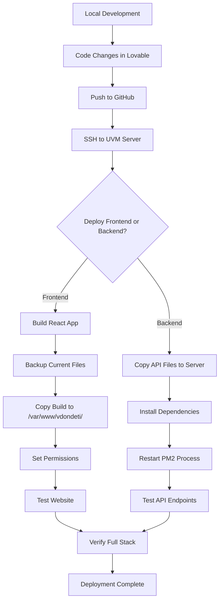

# Complete Hosting Guide for vdondeti.w3.uvm.edu
## Summit2Shore Climate Data Repository - Full Stack Deployment Documentation

---

## Table of Contents
1. [Architecture Overview](#architecture-overview)
2. [System Components](#system-components)
3. [Database Configuration](#database-configuration)
4. [Backend API Server](#backend-api-server)
5. [Frontend React Application](#frontend-react-application)
6. [Deployment Process](#deployment-process)
7. [How Everything Connects](#how-everything-connects)
8. [Troubleshooting](#troubleshooting)

---

## Architecture Overview

### High-Level System Architecture

```
┌─────────────────────────────────────────────────────────────┐
│                    User's Browser                            │
│  (Accesses: https://vdondeti.w3.uvm.edu)                    │
└────────────────────┬────────────────────────────────────────┘
                     │
                     ▼
┌─────────────────────────────────────────────────────────────┐
│              Apache Web Server (UVM)                         │
│                 Port 80/443 (HTTPS)                          │
│  ┌────────────────────────────────────────────────────────┐ │
│  │  Serves: React Frontend (Static Files)                 │ │
│  │  Location: /var/www/vdondeti/                          │ │
│  └────────────────────────────────────────────────────────┘ │
│                                                               │
│  ┌────────────────────────────────────────────────────────┐ │
│  │  Proxies: API Requests to Backend                      │ │
│  │  /api/* → http://127.0.0.1:3001/api/*                 │ │
│  │  /health → http://127.0.0.1:3001/health               │ │
│  └────────────────────────────────────────────────────────┘ │
└────────────────────┬────────────────────────────────────────┘
                     │
                     ▼
┌─────────────────────────────────────────────────────────────┐
│           Node.js API Server (Backend)                       │
│              Port 3001 (Internal)                            │
│  Location: /var/www/vdondeti/api/                           │
│  Process Manager: PM2                                        │
│  ┌────────────────────────────────────────────────────────┐ │
│  │  Endpoints:                                             │ │
│  │  - GET /api/databases                                   │ │
│  │  - GET /api/databases/:db/tables                       │ │
│  │  - GET /api/databases/:db/data/:table                  │ │
│  │  - GET /api/databases/:db/download/:table              │ │
│  │  - GET /health                                          │ │
│  └────────────────────────────────────────────────────────┘ │
└────────────────────┬────────────────────────────────────────┘
                     │
                     ▼
┌─────────────────────────────────────────────────────────────┐
│            MySQL Database Server                             │
│         Host: web5.uvm.edu:3306                             │
│  ┌────────────────────────────────────────────────────────┐ │
│  │  Databases:                                             │ │
│  │  1. CRRELS2S_VTClimateRepository (Raw Data)            │ │
│  │  2. CRRELS2S_VTClimateRepository_Processed             │ │
│  │  3. CRRELS2S_ProcessedData (Final Clean)               │ │
│  │  4. CRRELS2S_cleaned_data_seasons (Seasonal)           │ │
│  │                                                          │ │
│  │  Main Tables:                                           │ │
│  │  - table1 (Primary Environmental Data)                 │ │
│  │  - Wind (Wind Measurements)                            │ │
│  │  - Precipitation (Precipitation Data)                   │ │
│  │  - SnowPkTempProfile (Snow Temperature Profile)        │ │
│  └────────────────────────────────────────────────────────┘ │
└─────────────────────────────────────────────────────────────┘
```

### Technology Stack

**Frontend:**
- React 18.3.1
- TypeScript
- Vite (Build Tool)
- TailwindCSS (Styling)
- React Router (Navigation)
- Recharts (Data Visualization)
- Leaflet (Maps)

**Backend:**
- Node.js
- Express.js
- MySQL2 (Database Driver)
- PM2 (Process Manager)
- CORS (Cross-Origin Resource Sharing)

**Server Infrastructure:**
- Apache HTTP Server (Web Server)
- mod_rewrite (URL Rewriting)
- mod_proxy (API Proxying)

---

## System Components

### 1. Frontend Application (React SPA)

**Location on Server:** `/var/www/vdondeti/`

**Key Features:**
- Single Page Application (SPA) with client-side routing
- Real-time data visualization and analytics
- Interactive maps for monitoring station locations
- Data download interface with filtering
- Responsive design for mobile and desktop

**Build Output:**
```
/var/www/vdondeti/
├── index.html              # Main HTML entry point
├── assets/
│   ├── index-[hash].js     # Main JavaScript bundle
│   ├── index-[hash].css    # Compiled CSS
│   └── [images/fonts]      # Static assets
├── lovable-uploads/        # Uploaded images/files
├── .htaccess              # Apache rewrite rules
└── robots.txt             # SEO configuration
```

**Key Files in Source:**
- `src/App.tsx` - Main application component with routing
- `src/lib/apiConfig.ts` - Runtime API URL configuration
- `src/services/dataDownloadService.ts` - API communication
- `src/pages/` - All page components

### 2. Backend API Server (Node.js/Express)

**Location on Server:** `/var/www/vdondeti/api/`

**Purpose:**
- Connects to MySQL databases
- Provides REST API for frontend
- Handles data queries and filtering
- Generates CSV downloads
- Manages database switching

**Main File:** `production-api-server.js`

**Key Features:**
```javascript
// Database Pool Configuration
const pool = mysql.createPool({
  host: 'web5.uvm.edu',
  user: 'crrels2s_admin',
  password: process.env.MYSQL_PASSWORD,
  port: 3306,
  waitForConnections: true,
  connectionLimit: 10,
  queueLimit: 0
});

// Supported Databases
const DATABASES = {
  'raw_data': 'CRRELS2S_VTClimateRepository',
  'initial_clean_data': 'CRRELS2S_VTClimateRepository_Processed',
  'final_clean_data': 'CRRELS2S_ProcessedData',
  'seasonal_clean_data': 'CRRELS2S_cleaned_data_seasons'
};
```

**API Endpoints:**
| Endpoint | Method | Purpose |
|----------|--------|---------|
| `/health` | GET | Health check, database connectivity test |
| `/api/databases` | GET | List all available databases |
| `/api/databases/:db/tables` | GET | List tables in a database |
| `/api/databases/:db/tables/:table/attributes` | GET | Get column metadata |
| `/api/databases/:db/tables/:table/locations` | GET | Get monitoring locations |
| `/api/databases/:db/data/:table` | GET | Query filtered data |
| `/api/databases/:db/download/:table` | GET | Download data as CSV |
| `/api/databases/:db/analytics/:table` | GET | Get analytics summaries |

### 3. Apache Web Server Configuration

**Location:** `/var/www/vdondeti/.htaccess`

**Purpose:**
- Serve static frontend files
- Proxy API requests to Node.js backend
- Handle client-side routing for React
- Manage favicon redirects

**Configuration:**
```apache
RewriteEngine On
RewriteBase /

# Serve UVM favicon for all routes
RedirectMatch 302 ^/favicon\.ico$ /lovable-uploads/6cc4d90f-0179-494a-a8be-7a9a1c70a0e9.png
RedirectMatch 302 ^/api/favicon\.ico$ /lovable-uploads/6cc4d90f-0179-494a-a8be-7a9a1c70a0e9.png

# Proxy API requests to Node.js backend
RewriteCond %{REQUEST_URI} ^/(health|api)
RewriteRule ^(.*)$ http://127.0.0.1:3001/$1 [P,L]

# Client-side routing for React
RewriteCond %{REQUEST_FILENAME} !-f
RewriteCond %{REQUEST_FILENAME} !-d
RewriteCond %{REQUEST_URI} !^/(health|api)
RewriteRule . /index.html [L]
```

**How It Works:**
1. When user visits `/about`, Apache serves `index.html`
2. React Router takes over and shows the About page
3. When frontend makes request to `/api/databases`, Apache proxies to `http://127.0.0.1:3001/api/databases`
4. Node.js backend processes the request and returns JSON
5. Frontend receives the data and renders it

---

## Database Configuration

### MySQL Server Details

**Host:** `web5.uvm.edu`  
**Port:** `3306`  
**User:** `crrels2s_admin`  
**Password:** `y0m5dxldXSLP` (stored in server environment)

### Database Structure

#### 1. CRRELS2S_VTClimateRepository (Raw Data)

**Purpose:** Original, unprocessed environmental data from monitoring stations

**Key Tables:**
- `table1` - Primary environmental measurements (45,000+ records)
- `Wind` - Wind speed and direction data
- `Precipitation` - Precipitation measurements
- `SnowPkTempProfile` - Snowpack temperature at various depths

**Sample Data Structure (table1):**
```sql
┌─────────────────────┬──────────┬─────────────┬────────────┬─────────────┐
│ TIMESTAMP           │ LOCATION │ AirTC_Avg   │ RH         │ SWE         │
├─────────────────────┼──────────┼─────────────┼────────────┼─────────────┤
│ 2024-01-15 10:00:00 │ RB01     │ -5.2        │ 78.5       │ 125.3       │
│ 2024-01-15 10:15:00 │ RB01     │ -5.1        │ 79.1       │ 125.5       │
│ 2024-01-15 10:30:00 │ RB01     │ -5.3        │ 78.9       │ 125.4       │
└─────────────────────┴──────────┴─────────────┴────────────┴─────────────┘
```

#### 2. CRRELS2S_VTClimateRepository_Processed (Initial Clean Data)

**Purpose:** Data with basic quality control and validation

**Processing Applied:**
- Removed obvious outliers
- Filled minor data gaps
- Applied median filters to noisy data
- Added DataQualityFlag column

#### 3. CRRELS2S_ProcessedData (Final Clean Data)

**Purpose:** Fully processed, analysis-ready data

**Processing Applied:**
- Advanced outlier detection and removal
- Comprehensive gap-filling algorithms
- Cross-validation between stations
- Derived parameters calculated

#### 4. CRRELS2S_cleaned_data_seasons (Seasonal Clean Data)

**Purpose:** Data organized by meteorological seasons

**Tables:**
- `cleaned_data_season_Winter` (Dec-Feb)
- `cleaned_data_season_Spring` (Mar-May)
- `cleaned_data_season_Summer` (Jun-Aug)
- `cleaned_data_season_Fall` (Sep-Nov)

### Monitoring Station Locations

**16 Stations Across Vermont:**

```
Station Code | Name                          | Lat      | Lon       | Elevation
─────────────┼───────────────────────────────┼──────────┼───────────┼──────────
RB01         | Mansfield East Ranch Brook 1  | 44.2619  | -72.8081  | 1200m
RB02         | Mansfield East Ranch Brook 2  | 44.2625  | -72.8075  | 1180m
RB03-RB11    | Ranch Brook Stations 3-11     | ...      | ...       | ...
RB12         | Mansfield East FEMC           | 44.2685  | -72.8015  | 980m
SPER         | Spear Street                  | 44.4759  | -73.1959  | 120m
SR01         | Sleepers R3/Main              | 44.2891  | -72.8211  | 900m
SR11         | Sleepers W1/R11               | 44.2885  | -72.8205  | 920m
SR25         | Sleepers R25                  | 44.2879  | -72.8199  | 940m
JRCL         | Jericho Clearing              | 44.4919  | -72.9659  | 300m
JRFO         | Jericho Forest                | 44.4925  | -72.9665  | 320m
PROC         | Mansfield West Proctor        | 44.2561  | -72.8141  | 1300m
PTSH         | Potash Brook                  | 44.2567  | -72.8147  | 1280m
SUMM         | Mansfield SUMMIT              | 44.2573  | -72.8153  | 1339m (highest)
UNDR         | Mansfield West SCAN           | 44.2555  | -72.8135  | 1260m
```

### Data Attributes (Measured Parameters)

**table1 - Environmental Data Columns:**

| Column | Description | Unit | Category |
|--------|-------------|------|----------|
| TIMESTAMP | Date and time of measurement | ISO 8601 | Time |
| LOCATION | Station identifier | Code | Location |
| AirTC_Avg | Average air temperature | °C | Temperature |
| RH | Relative humidity | % | Humidity |
| SWE | Snow water equivalent | mm H₂O | Snow |
| DBTCDT | Snow depth | cm | Snow |
| SW_in | Incoming shortwave radiation | W/m² | Radiation |
| SW_out | Outgoing shortwave radiation | W/m² | Radiation |
| LW_in | Incoming longwave radiation | W/m² | Radiation |
| LW_out | Outgoing longwave radiation | W/m² | Radiation |
| Soil_Temperature_C | Soil temperature | °C | Soil |
| Soil_Moisture | Volumetric water content | wfv | Soil |
| SHF | Soil heat flux | W/m² | Soil |
| Ice_content | Ice content in snowpack | % | Snow |
| Water_Content | Liquid water in snowpack | % | Snow |
| Snowpack_Density | Snowpack density | kg/m³ | Snow |
| Batt_Volt_Min | Minimum battery voltage | V | System |
| DataQualityFlag | Quality indicator (0/1) | Flag | Quality |

---

## Backend API Server

### File Structure

```
/var/www/vdondeti/api/
├── production-api-server.js   # Main API server code
├── production-package.json     # Dependencies
├── package-lock.json          # Locked versions
├── node_modules/              # Installed packages
└── .env                       # Environment variables (optional)
```

### Environment Configuration

**Option 1: Environment Variables (Recommended)**
```bash
# /var/www/vdondeti/api/.env
MYSQL_HOST=web5.uvm.edu
MYSQL_USER=crrels2s_admin
MYSQL_PASSWORD=y0m5dxldXSLP
MYSQL_PORT=3306
PORT=3001
```

**Option 2: Hardcoded (Current Implementation)**
```javascript
// In production-api-server.js
const pool = mysql.createPool({
  host: 'web5.uvm.edu',
  user: process.env.MYSQL_USER || 'crrels2s_admin',
  password: process.env.MYSQL_PASSWORD || 'y0m5dxldXSLP',
  port: Number(process.env.MYSQL_PORT) || 3306,
  // ...
});
```

### CORS Configuration

**Allowed Origins:**
```javascript
app.use(cors({
  origin: [
    'https://www.uvm.edu',
    'https://vdondeti.w3.uvm.edu',
    'http://localhost:5173',  // Local development
    'https://5d5ff90d-8cee-4075-81bd-555a25d8e14f.sandbox.lovable.dev'  // Lovable preview
  ],
  credentials: true
}));
```

### API Request Flow Example

**Example: Fetching Temperature Data**

```javascript
// Frontend Request
const response = await fetch('/api/databases/raw_data/data/table1?' + new URLSearchParams({
  location: 'RB01',
  start_date: '2024-01-01',
  end_date: '2024-01-31',
  attributes: 'TIMESTAMP,AirTC_Avg,RH',
  limit: '1000'
}));

const data = await response.json();
```

**Backend Processing:**
```javascript
// 1. Parse parameters
const { location, start_date, end_date, attributes, limit } = req.query;

// 2. Build SQL query
let sql = `SELECT ${attributes || '*'} FROM table1 WHERE 1=1`;
const params = [];

if (location) {
  sql += ` AND LOCATION = ?`;
  params.push(location);
}

if (start_date) {
  sql += ` AND TIMESTAMP >= ?`;
  params.push(start_date);
}

if (end_date) {
  sql += ` AND TIMESTAMP <= ?`;
  params.push(end_date);
}

sql += ` ORDER BY TIMESTAMP DESC LIMIT ${parseInt(limit) || 1000}`;

// 3. Execute query
const [rows] = await connection.execute(sql, params);

// 4. Return JSON
res.json({
  database: 'CRRELS2S_VTClimateRepository',
  table: 'table1',
  filters: { location, start_date, end_date },
  count: rows.length,
  data: rows
});
```

### Process Management with PM2

**Starting the API Server:**
```bash
cd /var/www/vdondeti/api
pm2 start production-api-server.js --name summit2shore-api
pm2 save
pm2 startup
```

**PM2 Commands:**
```bash
# Check status
pm2 status

# View logs
pm2 logs summit2shore-api

# Restart
pm2 restart summit2shore-api

# Stop
pm2 stop summit2shore-api

# Monitor resources
pm2 monit
```

**Auto-Restart on Server Reboot:**
```bash
# Generate startup script
pm2 startup

# Save current PM2 configuration
pm2 save
```

---

## Frontend React Application

### Runtime API Configuration

**File:** `src/lib/apiConfig.ts`

**How It Works:**
```typescript
export const getApiBaseUrl = (): string => {
  const w = typeof window !== 'undefined' ? (window as any) : undefined;

  // 1) Optional runtime override via global config
  const cfg = w?.__APP_CONFIG__?.API_BASE_URL;
  if (cfg) return cfg.replace(/\/$/, '');

  // 2) Production: UVM deployment - use same domain
  if (w && w.location.hostname.includes('uvm.edu')) {
    return `https://${w.location.hostname}`;
  }

  // 3) Production: any non-localhost
  if (w && w.location.hostname !== 'localhost' && w.location.hostname !== '127.0.0.1') {
    return `https://${w.location.hostname}`;
  }

  // 4) Local dev fallback
  if (w && (w.location.hostname === 'localhost' || w.location.hostname === '127.0.0.1')) {
    return 'http://localhost:3001';
  }

  // 5) Ultimate fallback
  return 'https://vdondeti.w3.uvm.edu';
};
```

**Why Runtime Configuration?**
- No need for environment variables during build
- Same build works on any domain
- Automatically detects production vs. development
- Simplifies deployment to multiple servers

### Data Services

**File:** `src/services/dataDownloadService.ts`

**Key Functions:**
```typescript
// Fetch all databases
export const fetchDatabases = async () => {
  const response = await fetch(`${API_BASE_URL}/api/databases`);
  return response.json();
};

// Fetch tables for a database
export const fetchTables = async (database: string) => {
  const response = await fetch(`${API_BASE_URL}/api/databases/${database}/tables`);
  return response.json();
};

// Download data as CSV
export const downloadTableData = async (database: string, table: string, filters: Filters) => {
  const params = new URLSearchParams({
    location: filters.location,
    start_date: filters.startDate,
    end_date: filters.endDate,
    attributes: filters.attributes.join(',')
  });
  
  const url = `${API_BASE_URL}/api/databases/${database}/download/${table}?${params}`;
  window.open(url, '_blank');
};
```

### Page Routing

**File:** `src/App.tsx`

```typescript
<BrowserRouter>
  <ScrollToTop />  {/* Scroll to top on navigation */}
  <Routes>
    <Route path="/" element={<Home />} />
    <Route path="/about" element={<About />} />
    <Route path="/network" element={<Network />} />
    <Route path="/research" element={<Research />} />
    
    {/* Data Download Section */}
    <Route path="/download" element={<DataDownload />} />
    <Route path="/download/bulk-request" element={<BulkRequest />} />
    
    {/* Analytics Section */}
    <Route path="/analytics" element={<Analytics />} />
    <Route path="/analytics/snow" element={<SnowAnalytics />} />
    <Route path="/analytics/advanced" element={<AdvancedAnalytics />} />
    <Route path="/analytics/comparison" element={<DataComparison />} />
    <Route path="/analytics/realtime" element={<RealTime />} />
    
    {/* Documentation */}
    <Route path="/documentation" element={<Documentation />} />
    <Route path="/documentation/api" element={<APIDocumentation />} />
    
    <Route path="*" element={<NotFound />} />
  </Routes>
</BrowserRouter>
```

### Component Architecture

```
src/
├── components/
│   ├── Header.tsx                    # Navigation with dropdowns
│   ├── Footer.tsx                    # Site footer
│   ├── Hero.tsx                      # Homepage hero section
│   ├── DatabaseSelector.tsx          # Database picker
│   ├── TableSelector.tsx             # Table picker
│   ├── LocationSelector.tsx          # Station filter
│   ├── DateRangeSelector.tsx         # Date range picker
│   ├── AttributeSelector.tsx         # Column selector
│   ├── DataMap.tsx                   # Interactive station map
│   ├── SnowDepthChart.tsx           # Snow depth visualization
│   └── ui/                          # Reusable UI components
│       ├── button.tsx
│       ├── card.tsx
│       ├── select.tsx
│       └── ...
├── pages/
│   ├── Home.tsx                     # Landing page
│   ├── DataDownload.tsx             # Main download interface
│   ├── Analytics.tsx                # Analytics dashboard
│   └── ...
├── services/
│   ├── dataDownloadService.ts       # API communication
│   └── analyticsService.ts          # Analytics data
├── hooks/
│   ├── useDataDownload.ts           # Data fetching logic
│   └── useAnalyticsData.ts          # Analytics hooks
└── lib/
    ├── apiConfig.ts                 # API URL configuration
    └── utils.ts                     # Utility functions
```

---

## Deployment Process

### Full Deployment Workflow



### Automated Deployment Script

**File:** `deploy-dual.sh`

**Usage:**
```bash
# Deploy to both testing and production
./deploy-dual.sh both

# Deploy to testing only
./deploy-dual.sh testing

# Deploy to production only
./deploy-dual.sh production
```

**What It Does:**
1. Builds the React application (`npm run build`)
2. Creates timestamped backup of current deployment
3. Clears old files from server directory
4. Uploads new build via SCP
5. Sets proper file permissions (755)
6. Verifies `.htaccess` exists
7. Checks for development URLs in production build

**Script Configuration:**
```bash
#!/bin/bash

# Testing Server
TESTING_HOST="vdondeti.w3.uvm.edu"
TESTING_USER="vdondeti"
TESTING_PATH="/var/www/vdondeti"

# Production Server
PROD_HOST="crrels2s.w3.uvm.edu"
PROD_USER="crrels2s"
PROD_PATH="/var/www/crrels2s"
```

### Manual Deployment Steps

#### Frontend Deployment

**Step 1: Build the Application Locally**
```bash
# In your local project directory
npm run build

# This creates the dist/ folder with optimized production files
```

**Step 2: Backup Current Production Files**
```bash
# SSH to server
ssh vdondeti@vdondeti.w3.uvm.edu

# Create timestamped backup
cd /var/www
tar -czf vdondeti-backup-$(date +%Y%m%d-%H%M%S).tar.gz vdondeti/

# Or copy to backup directory
cp -r vdondeti vdondeti-backup-$(date +%Y%m%d-%H%M%S)
```

**Step 3: Clear Old Files**
```bash
# Remove all files except .htaccess
cd /var/www/vdondeti
find . -mindepth 1 ! -name '.htaccess' -delete
```

**Step 4: Upload New Build**
```bash
# From your local machine
scp -r dist/* vdondeti@vdondeti.w3.uvm.edu:/var/www/vdondeti/
```

**Step 5: Set Permissions**
```bash
# SSH to server
ssh vdondeti@vdondeti.w3.uvm.edu

# Set proper permissions
cd /var/www/vdondeti
find . -type f -exec chmod 644 {} \;
find . -type d -exec chmod 755 {} \;
chmod 644 .htaccess
```

**Step 6: Verify Deployment**
```bash
# Check files are present
ls -la /var/www/vdondeti/

# Should see:
# index.html
# assets/
# lovable-uploads/
# .htaccess
# robots.txt

# Test the website
curl -I https://vdondeti.w3.uvm.edu/
# Should return 200 OK
```

#### Backend API Deployment

**Step 1: Prepare API Files**
```bash
# In your local project
# Ensure production-api-server.js and production-package.json are up to date
```

**Step 2: Upload to Server**
```bash
# Create API directory if doesn't exist
ssh vdondeti@vdondeti.w3.uvm.edu "mkdir -p /var/www/vdondeti/api"

# Upload server files
scp production-api-server.js vdondeti@vdondeti.w3.uvm.edu:/var/www/vdondeti/api/
scp production-package.json vdondeti@vdondeti.w3.uvm.edu:/var/www/vdondeti/api/package.json
```

**Step 3: Install Dependencies**
```bash
# SSH to server
ssh vdondeti@vdondeti.w3.uvm.edu

# Install packages
cd /var/www/vdondeti/api
npm install --production
```

**Step 4: Configure Environment (Optional)**
```bash
# Create .env file if needed
cat > /var/www/vdondeti/api/.env << 'EOF'
MYSQL_HOST=web5.uvm.edu
MYSQL_USER=crrels2s_admin
MYSQL_PASSWORD=y0m5dxldXSLP
MYSQL_PORT=3306
PORT=3001
EOF

chmod 600 .env  # Restrict permissions for security
```

**Step 5: Start/Restart with PM2**
```bash
# First time setup
pm2 start production-api-server.js --name summit2shore-api
pm2 save
pm2 startup  # Follow instructions to enable auto-start

# Subsequent updates
pm2 restart summit2shore-api

# Or reload (zero-downtime)
pm2 reload summit2shore-api
```

**Step 6: Verify API is Running**
```bash
# Check PM2 status
pm2 status

# Should show:
# ┌─────┬────────────────────┬─────────┬───────┬─────────┬─────────┐
# │ id  │ name               │ status  │ cpu   │ memory  │ restart │
# ├─────┼────────────────────┼─────────┼───────┼─────────┼─────────┤
# │ 0   │ summit2shore-api   │ online  │ 0.5%  │ 45.2 MB │ 0       │
# └─────┴────────────────────┴─────────┴───────┴─────────┴─────────┘

# Test health endpoint
curl http://localhost:3001/health
# Should return: {"status":"healthy","timestamp":"2024-..."}

# Test from public URL
curl https://vdondeti.w3.uvm.edu/health
# Should return same result (proxied through Apache)

# Test database connection
curl https://vdondeti.w3.uvm.edu/api/databases
# Should return list of databases
```

### Rollback Procedure

**If Something Goes Wrong:**

**Frontend Rollback:**
```bash
# SSH to server
ssh vdondeti@vdondeti.w3.uvm.edu

# List available backups
ls -la /var/www/vdondeti-backup-*

# Restore from backup
cd /var/www
rm -rf vdondeti/*
tar -xzf vdondeti-backup-20240115-143022.tar.gz
# Or: cp -r vdondeti-backup-20240115-143022/* vdondeti/

# Verify restoration
curl -I https://vdondeti.w3.uvm.edu/
```

**Backend Rollback:**
```bash
# Stop current version
pm2 stop summit2shore-api

# Restore previous API file
cd /var/www/vdondeti/api
cp production-api-server.js production-api-server.js.failed
cp production-api-server.js.backup production-api-server.js

# Restart
pm2 start production-api-server.js --name summit2shore-api

# Verify
curl http://localhost:3001/health
```

---

## How Everything Connects

### Data Flow: User Request to Database and Back

**Scenario: User downloads temperature data for Station RB01**

```
┌─────────────────────────────────────────────────────────────────────┐
│ 1. USER ACTION                                                       │
│    User fills out download form:                                    │
│    - Database: Raw Data                                             │
│    - Table: Primary Environmental Data                              │
│    - Location: RB01                                                 │
│    - Date Range: 2024-01-01 to 2024-01-31                          │
│    - Attributes: TIMESTAMP, AirTC_Avg, RH                           │
│    - Click "Download CSV"                                           │
└──────────────────────────┬──────────────────────────────────────────┘
                           │
                           ▼
┌─────────────────────────────────────────────────────────────────────┐
│ 2. FRONTEND (React)                                                  │
│    File: src/components/DownloadInterface.tsx                       │
│                                                                      │
│    const handleDownload = async () => {                            │
│      const filters = {                                              │
│        location: 'RB01',                                            │
│        startDate: '2024-01-01',                                     │
│        endDate: '2024-01-31',                                       │
│        attributes: ['TIMESTAMP', 'AirTC_Avg', 'RH']                │
│      };                                                             │
│                                                                      │
│      await downloadTableData('raw_data', 'table1', filters);       │
│    };                                                               │
└──────────────────────────┬──────────────────────────────────────────┘
                           │
                           ▼
┌─────────────────────────────────────────────────────────────────────┐
│ 3. API SERVICE                                                       │
│    File: src/services/dataDownloadService.ts                        │
│                                                                      │
│    export const downloadTableData = async (...) => {               │
│      const params = new URLSearchParams({                          │
│        location: 'RB01',                                            │
│        start_date: '2024-01-01',                                    │
│        end_date: '2024-01-31',                                      │
│        attributes: 'TIMESTAMP,AirTC_Avg,RH'                        │
│      });                                                            │
│                                                                      │
│      const url = `${API_BASE_URL}/api/databases/raw_data/` +       │
│                  `download/table1?${params}`;                       │
│      window.open(url, '_blank');                                    │
│    };                                                               │
│                                                                      │
│    GENERATED URL:                                                   │
│    https://vdondeti.w3.uvm.edu/api/databases/raw_data/             │
│      download/table1?location=RB01&start_date=2024-01-01&          │
│      end_date=2024-01-31&attributes=TIMESTAMP,AirTC_Avg,RH         │
└──────────────────────────┬──────────────────────────────────────────┘
                           │
                           ▼
┌─────────────────────────────────────────────────────────────────────┐
│ 4. BROWSER REQUEST                                                   │
│    GET https://vdondeti.w3.uvm.edu/api/databases/raw_data/         │
│        download/table1?location=RB01&start_date=2024-01-01&        │
│        end_date=2024-01-31&attributes=TIMESTAMP,AirTC_Avg,RH       │
│                                                                      │
│    Headers:                                                         │
│    - Host: vdondeti.w3.uvm.edu                                     │
│    - Accept: text/csv                                               │
│    - Origin: https://vdondeti.w3.uvm.edu                           │
└──────────────────────────┬──────────────────────────────────────────┘
                           │
                           ▼
┌─────────────────────────────────────────────────────────────────────┐
│ 5. APACHE WEB SERVER                                                 │
│    Location: /var/www/vdondeti/.htaccess                           │
│                                                                      │
│    # Request matches: /api/databases/raw_data/download/table1      │
│    RewriteCond %{REQUEST_URI} ^/(health|api)                        │
│    RewriteRule ^(.*)$ http://127.0.0.1:3001/$1 [P,L]              │
│                                                                      │
│    PROXIED TO:                                                      │
│    http://127.0.0.1:3001/api/databases/raw_data/download/table1   │
│      ?location=RB01&start_date=2024-01-01&...                      │
└──────────────────────────┬──────────────────────────────────────────┘
                           │
                           ▼
┌─────────────────────────────────────────────────────────────────────┐
│ 6. NODE.JS API SERVER                                                │
│    File: /var/www/vdondeti/api/production-api-server.js            │
│    Port: 3001                                                       │
│                                                                      │
│    app.get('/api/databases/:database/download/:table', async ...) { │
│                                                                      │
│      // Parse parameters                                            │
│      const database = 'raw_data';                                   │
│      const table = 'table1';                                        │
│      const { location, start_date, end_date, attributes } = req.query;│
│                                                                      │
│      // Get database connection                                     │
│      const { connection } = await getConnectionWithDB(database);   │
│      // This uses: CRRELS2S_VTClimateRepository                     │
│                                                                      │
│      // Build SQL query                                             │
│      let sql = `SELECT ${attributes} FROM table1                   │
│                 WHERE LOCATION = ?                                  │
│                 AND TIMESTAMP >= ?                                  │
│                 AND TIMESTAMP <= ?                                  │
│                 ORDER BY TIMESTAMP ASC`;                            │
│                                                                      │
│      const params = ['RB01', '2024-01-01', '2024-01-31'];          │
│    }                                                                │
└──────────────────────────┬──────────────────────────────────────────┘
                           │
                           ▼
┌─────────────────────────────────────────────────────────────────────┐
│ 7. MySQL DATABASE SERVER                                             │
│    Host: web5.uvm.edu:3306                                          │
│    Database: CRRELS2S_VTClimateRepository                           │
│                                                                      │
│    EXECUTE QUERY:                                                   │
│    SELECT TIMESTAMP, AirTC_Avg, RH                                  │
│    FROM table1                                                      │
│    WHERE LOCATION = 'RB01'                                          │
│      AND TIMESTAMP >= '2024-01-01 00:00:00'                        │
│      AND TIMESTAMP <= '2024-01-31 23:59:59'                        │
│    ORDER BY TIMESTAMP ASC;                                          │
│                                                                      │
│    RESULTS: 2,976 rows                                              │
│    (Every 15 minutes for 31 days)                                   │
└──────────────────────────┬──────────────────────────────────────────┘
                           │
                           ▼
┌─────────────────────────────────────────────────────────────────────┐
│ 8. NODE.JS FORMATS RESPONSE                                          │
│                                                                      │
│    // Convert rows to CSV                                           │
│    const csv = [                                                    │
│      'TIMESTAMP,AirTC_Avg,RH',  // Header                           │
│      ...rows.map(row =>                                             │
│        `${row.TIMESTAMP},${row.AirTC_Avg},${row.RH}`               │
│      )                                                              │
│    ].join('\n');                                                    │
│                                                                      │
│    // Set headers                                                   │
│    res.setHeader('Content-Type', 'text/csv');                       │
│    res.setHeader('Content-Disposition',                             │
│      'attachment; filename="table1_RB01_2024-01-01_2024-01-31.csv"');│
│                                                                      │
│    // Send response                                                 │
│    res.send(csv);                                                   │
└──────────────────────────┬──────────────────────────────────────────┘
                           │
                           ▼
┌─────────────────────────────────────────────────────────────────────┐
│ 9. APACHE PROXIES RESPONSE BACK                                      │
│    Response proxied from 127.0.0.1:3001 to user's browser          │
└──────────────────────────┬──────────────────────────────────────────┘
                           │
                           ▼
┌─────────────────────────────────────────────────────────────────────┐
│ 10. BROWSER RECEIVES CSV                                             │
│     Content-Type: text/csv                                          │
│     Content-Disposition: attachment; filename="..."                 │
│                                                                      │
│     Browser triggers download:                                      │
│     table1_RB01_2024-01-01_2024-01-31.csv                          │
│                                                                      │
│     File Contents:                                                  │
│     TIMESTAMP,AirTC_Avg,RH                                          │
│     2024-01-01 00:00:00,-8.5,72.3                                  │
│     2024-01-01 00:15:00,-8.7,71.9                                  │
│     2024-01-01 00:30:00,-8.6,72.1                                  │
│     ...                                                             │
│     (2,976 rows total)                                              │
└─────────────────────────────────────────────────────────────────────┘
```

### Startup Sequence

**When Server Boots Up:**

```
1. APACHE WEB SERVER STARTS
   ├─ Loads configuration from httpd.conf
   ├─ Reads .htaccess files
   ├─ Starts listening on port 80/443
   └─ Ready to serve static files and proxy requests

2. PM2 STARTS AUTOMATICALLY (via systemd)
   ├─ pm2 resurrect (loads saved processes)
   ├─ Starts summit2shore-api
   └─ Node.js API server begins listening on port 3001

3. NODE.JS API SERVER INITIALIZES
   ├─ Loads production-api-server.js
   ├─ Connects to MySQL database pool
   │  └─ Host: web5.uvm.edu:3306
   ├─ Registers all API routes
   └─ Logs: "✅ Server running on port 3001"

4. DATABASE CONNECTION POOL READY
   ├─ 10 connections pre-established
   └─ Ready to handle queries

5. SYSTEM READY
   └─ Website accessible at https://vdondeti.w3.uvm.edu
```

---

## Troubleshooting

### Common Issues and Solutions

#### 1. Website Not Loading (404 or 500 Error)

**Symptoms:**
- Browser shows 404 Not Found
- Or 500 Internal Server Error

**Diagnosis:**
```bash
# SSH to server
ssh vdondeti@vdondeti.w3.uvm.edu

# Check if files exist
ls -la /var/www/vdondeti/
# Should see index.html, assets/, .htaccess

# Check Apache error logs
tail -100 /var/log/apache2/error.log
# Or wherever Apache logs are stored

# Check file permissions
ls -la /var/www/vdondeti/index.html
# Should be: -rw-r--r-- (644)

ls -la /var/www/vdondeti/
# Should be: drwxr-xr-x (755)
```

**Solutions:**
```bash
# Fix permissions
cd /var/www/vdondeti
find . -type f -exec chmod 644 {} \;
find . -type d -exec chmod 755 {} \;

# Verify .htaccess
cat /var/www/vdondeti/.htaccess
# Should contain rewrite rules

# If .htaccess is missing, recreate it
cat > /var/www/vdondeti/.htaccess << 'EOF'
RewriteEngine On
RewriteBase /

RedirectMatch 302 ^/favicon\.ico$ /lovable-uploads/6cc4d90f-0179-494a-a8be-7a9a1c70a0e9.png
RedirectMatch 302 ^/api/favicon\.ico$ /lovable-uploads/6cc4d90f-0179-494a-a8be-7a9a1c70a0e9.png

RewriteCond %{REQUEST_URI} ^/(health|api)
RewriteRule ^(.*)$ http://127.0.0.1:3001/$1 [P,L]

RewriteCond %{REQUEST_FILENAME} !-f
RewriteCond %{REQUEST_FILENAME} !-d
RewriteCond %{REQUEST_URI} !^/(health|api)
RewriteRule . /index.html [L]
EOF

chmod 644 /var/www/vdondeti/.htaccess
```

#### 2. API Not Responding (Network Error)

**Symptoms:**
- Frontend shows "Failed to fetch"
- Database dropdown is empty
- Console error: "NetworkError"

**Diagnosis:**
```bash
# Check if PM2 process is running
pm2 status

# If not running, check PM2 logs
pm2 logs summit2shore-api --lines 100

# Test API locally on server
curl http://localhost:3001/health
# Should return: {"status":"healthy",...}

# Test API through Apache proxy
curl https://vdondeti.w3.uvm.edu/health
# Should return same result

# Check if port 3001 is listening
netstat -tlnp | grep 3001
# Should show: tcp 0 0 :::3001 :::* LISTEN <pid>/node
```

**Solutions:**
```bash
# If PM2 not running, start it
cd /var/www/vdondeti/api
pm2 start production-api-server.js --name summit2shore-api
pm2 save

# If running but not responding, restart
pm2 restart summit2shore-api

# Check logs for errors
pm2 logs summit2shore-api

# If database connection error, verify credentials
node -e "
const mysql = require('mysql2/promise');
mysql.createPool({
  host: 'web5.uvm.edu',
  user: 'crrels2s_admin',
  password: 'y0m5dxldXSLP',
  port: 3306
}).getConnection().then(() => {
  console.log('✅ Database connection OK');
  process.exit(0);
}).catch(err => {
  console.error('❌ Database connection failed:', err);
  process.exit(1);
});
"
```

#### 3. CORS Errors

**Symptoms:**
- Console error: "Access to fetch at '...' from origin '...' has been blocked by CORS policy"
- API returns 200 but frontend can't read response

**Diagnosis:**
```bash
# Check CORS headers in API response
curl -I \
  -H "Origin: https://vdondeti.w3.uvm.edu" \
  https://vdondeti.w3.uvm.edu/api/databases

# Should include:
# Access-Control-Allow-Origin: https://vdondeti.w3.uvm.edu
# Access-Control-Allow-Credentials: true
```

**Solution:**
```bash
# Edit production-api-server.js
nano /var/www/vdondeti/api/production-api-server.js

# Update CORS configuration to include your domain:
app.use(cors({
  origin: [
    'https://vdondeti.w3.uvm.edu',
    'https://www.uvm.edu',
    'http://localhost:5173'
  ],
  credentials: true
}));

# Restart API
pm2 restart summit2shore-api
```

#### 4. Database Connection Failed

**Symptoms:**
- API logs show: "❌ Database connection failed"
- Health endpoint returns unhealthy

**Diagnosis:**
```bash
# Test MySQL connection from server
mysql -h web5.uvm.edu -u crrels2s_admin -p
# Enter password: y0m5dxldXSLP

# If connection succeeds:
SHOW DATABASES;
# Should list: CRRELS2S_VTClimateRepository, etc.

# Check if host is reachable
ping web5.uvm.edu

# Check if port 3306 is accessible
telnet web5.uvm.edu 3306
# Should connect
```

**Solutions:**
```bash
# If credentials are wrong, update in production-api-server.js
nano /var/www/vdondeti/api/production-api-server.js

# Find and update:
const pool = mysql.createPool({
  host: 'web5.uvm.edu',  # Verify correct host
  user: 'crrels2s_admin',  # Verify correct user
  password: 'y0m5dxldXSLP',  # Verify correct password
  port: 3306
});

# Restart API
pm2 restart summit2shore-api

# If firewall is blocking, contact UVM IT
# MySQL port 3306 needs to be open between servers
```

#### 5. React Router Not Working (Page Refreshes Show 404)

**Symptoms:**
- Navigation works fine when clicking links
- But refreshing page on `/about` shows 404
- Direct URL access fails

**Cause:** Missing or incorrect `.htaccess` configuration

**Solution:**
```bash
# SSH to server
ssh vdondeti@vdondeti.w3.uvm.edu

# Verify .htaccess exists
cat /var/www/vdondeti/.htaccess

# Should contain client-side routing rules:
RewriteCond %{REQUEST_FILENAME} !-f
RewriteCond %{REQUEST_FILENAME} !-d
RewriteCond %{REQUEST_URI} !^/(health|api)
RewriteRule . /index.html [L]

# If missing or incorrect, recreate as shown in Issue #1
```

#### 6. Slow Query Performance

**Symptoms:**
- API takes >5 seconds to respond
- Large date ranges timeout
- CSV downloads fail for big datasets

**Diagnosis:**
```bash
# SSH to server
ssh vdondeti@vdondeti.w3.uvm.edu

# Test query speed
time curl "https://vdondeti.w3.uvm.edu/api/databases/raw_data/data/table1?start_date=2024-01-01&end_date=2024-12-31"

# Check MySQL slow query log
# (Requires MySQL server access)
```

**Solutions:**

**Option 1: Add Database Indexes**
```sql
-- SSH to database server or use MySQL client
mysql -h web5.uvm.edu -u crrels2s_admin -p

USE CRRELS2S_VTClimateRepository;

-- Add indexes for common queries
CREATE INDEX idx_timestamp ON table1(TIMESTAMP);
CREATE INDEX idx_location ON table1(LOCATION);
CREATE INDEX idx_location_timestamp ON table1(LOCATION, TIMESTAMP);

-- Check index usage
SHOW INDEX FROM table1;
```

**Option 2: Optimize API Query**
```javascript
// In production-api-server.js

// Add pagination
const limit = parseInt(req.query.limit) || 1000;
const offset = parseInt(req.query.offset) || 0;

sql += ` LIMIT ${limit} OFFSET ${offset}`;

// Use streaming for large CSV downloads
const stream = connection.query(sql, params).stream();
stream.pipe(csvTransform).pipe(res);
```

**Option 3: Implement Caching**
```javascript
// Add simple in-memory cache
const NodeCache = require('node-cache');
const cache = new NodeCache({ stdTTL: 600 }); // 10 min cache

app.get('/api/databases/:database/data/:table', async (req, res) => {
  const cacheKey = `${req.params.database}_${req.params.table}_${JSON.stringify(req.query)}`;
  
  const cached = cache.get(cacheKey);
  if (cached) {
    return res.json(cached);
  }
  
  // ... fetch from database ...
  
  cache.set(cacheKey, data);
  res.json(data);
});
```

#### 7. PM2 Process Not Auto-Starting on Reboot

**Symptoms:**
- After server restart, API is down
- PM2 shows no processes

**Solution:**
```bash
# SSH to server
ssh vdondeti@vdondeti.w3.uvm.edu

# Start your API
cd /var/www/vdondeti/api
pm2 start production-api-server.js --name summit2shore-api

# Save PM2 process list
pm2 save

# Generate and install startup script
pm2 startup
# This will output a command like:
# sudo env PATH=$PATH:/usr/bin pm2 startup systemd -u vdondeti --hp /home/vdondeti

# Run the command it outputs (requires sudo)
sudo env PATH=$PATH:/usr/bin pm2 startup systemd -u vdondeti --hp /home/vdondeti

# Verify startup is configured
systemctl status pm2-vdondeti

# Test by rebooting
sudo reboot

# After reboot, verify
pm2 status
# Should show summit2shore-api running
```

### Monitoring and Maintenance

#### Daily Health Checks

```bash
# Check website is accessible
curl -I https://vdondeti.w3.uvm.edu/
# Expect: HTTP/2 200

# Check API health
curl https://vdondeti.w3.uvm.edu/health
# Expect: {"status":"healthy",...}

# Check PM2 status
pm2 status
# Expect: summit2shore-api online, 0 restarts

# Check API logs for errors
pm2 logs summit2shore-api --lines 50 --nostream | grep -i error

# Check database connection
curl https://vdondeti.w3.uvm.edu/api/databases
# Expect: JSON list of databases
```

#### Weekly Maintenance

```bash
# Check disk space
df -h /var/www
# Ensure >20% free space

# Clean old backups (keep last 10)
cd /var/www
ls -t vdondeti-backup-*.tar.gz | tail -n +11 | xargs rm -f

# Rotate PM2 logs
pm2 flush

# Check for package updates
cd /var/www/vdondeti/api
npm outdated
```

#### Monthly Tasks

```bash
# Update Node.js packages (test in staging first)
cd /var/www/vdondeti/api
npm update
pm2 restart summit2shore-api

# Review Apache access logs
tail -1000 /var/log/apache2/access.log | grep "api/databases"

# Database optimization (coordinate with DBA)
# OPTIMIZE TABLE table1;
# ANALYZE TABLE table1;
```

---

## Security Best Practices

### 1. Protect Database Credentials

**❌ Bad: Hardcoded in Source Code**
```javascript
const pool = mysql.createPool({
  password: 'y0m5dxldXSLP'  // Visible in Git!
});
```

**✅ Good: Environment Variables**
```bash
# .env file (not in Git)
MYSQL_PASSWORD=y0m5dxldXSLP

# In code
password: process.env.MYSQL_PASSWORD
```

**Set permissions:**
```bash
chmod 600 /var/www/vdondeti/api/.env
```

### 2. Limit Database User Permissions

```sql
-- Create read-only user for API
CREATE USER 'api_readonly'@'%' IDENTIFIED BY 'secure_password';

GRANT SELECT ON CRRELS2S_VTClimateRepository.* TO 'api_readonly'@'%';
GRANT SELECT ON CRRELS2S_VTClimateRepository_Processed.* TO 'api_readonly'@'%';

FLUSH PRIVILEGES;
```

### 3. Implement Rate Limiting

```javascript
// In production-api-server.js
const rateLimit = require('express-rate-limit');

const limiter = rateLimit({
  windowMs: 15 * 60 * 1000, // 15 minutes
  max: 100, // Limit each IP to 100 requests per windowMs
  message: 'Too many requests, please try again later.'
});

app.use('/api', limiter);
```

### 4. Sanitize User Input

```javascript
// Validate and sanitize parameters
const { location, start_date, end_date } = req.query;

// Whitelist allowed locations
const allowedLocations = ['RB01', 'RB02', ..., 'SUMM'];
if (location && !allowedLocations.includes(location)) {
  return res.status(400).json({ error: 'Invalid location' });
}

// Validate date format
if (start_date && !/^\d{4}-\d{2}-\d{2}$/.test(start_date)) {
  return res.status(400).json({ error: 'Invalid date format' });
}
```

### 5. Keep Software Updated

```bash
# Update Node.js
nvm install --lts
nvm use --lts

# Update npm packages
cd /var/www/vdondeti/api
npm audit
npm audit fix

# Update PM2
npm install pm2@latest -g
```

### 6. Monitor Access Logs

```bash
# Check for suspicious activity
grep -i "sql" /var/log/apache2/access.log
grep -i "script" /var/log/apache2/access.log
grep "401\|403\|500" /var/log/apache2/access.log
```

---

## Performance Optimization

### 1. Enable Gzip Compression

**Apache Configuration:**
```apache
# In Apache config or .htaccess
<IfModule mod_deflate.c>
  AddOutputFilterByType DEFLATE text/html text/css text/javascript application/javascript application/json
</IfModule>
```

### 2. Browser Caching

```apache
# Cache static assets
<IfModule mod_expires.c>
  ExpiresActive On
  ExpiresByType image/png "access plus 1 year"
  ExpiresByType text/css "access plus 1 month"
  ExpiresByType application/javascript "access plus 1 month"
</IfModule>
```

### 3. Database Query Optimization

```sql
-- Add indexes for common queries
CREATE INDEX idx_timestamp_location ON table1(TIMESTAMP, LOCATION);

-- Analyze table for optimization
ANALYZE TABLE table1;
```

### 4. API Response Caching

```javascript
// Install node-cache
npm install node-cache

// In production-api-server.js
const NodeCache = require('node-cache');
const cache = new NodeCache({ stdTTL: 300 }); // 5 minutes

app.get('/api/databases', (req, res) => {
  const cached = cache.get('databases');
  if (cached) return res.json(cached);
  
  // Fetch from database...
  cache.set('databases', data);
  res.json(data);
});
```

### 5. Frontend Build Optimization

**Vite Configuration:**
```typescript
// vite.config.ts
export default defineConfig({
  build: {
    rollupOptions: {
      output: {
        manualChunks: {
          'react-vendor': ['react', 'react-dom', 'react-router-dom'],
          'chart-vendor': ['recharts'],
          'map-vendor': ['leaflet', 'react-leaflet']
        }
      }
    },
    chunkSizeWarningLimit: 1000
  }
});
```

---

## Conclusion

This comprehensive guide covers the complete hosting setup for your Summit2Shore Climate Data Repository on vdondeti.w3.uvm.edu. 

**Key Takeaways:**
1. **Frontend (React)** is served as static files by Apache
2. **Backend (Node.js API)** runs on port 3001, managed by PM2
3. **Apache** proxies `/api` and `/health` requests to the backend
4. **Database (MySQL)** is on a separate server (web5.uvm.edu)
5. **Runtime configuration** automatically detects production vs. development
6. **Automated deployment** script handles both testing and production servers

**Quick Reference Commands:**
```bash
# Deploy frontend
./deploy-dual.sh production

# Restart backend
pm2 restart summit2shore-api

# Check system health
curl https://vdondeti.w3.uvm.edu/health

# View API logs
pm2 logs summit2shore-api

# Rollback frontend
cp -r /var/www/vdondeti-backup-TIMESTAMP/* /var/www/vdondeti/
```

For additional support or questions, refer to the individual documentation files or contact the development team.

---

**Last Updated:** 2025-01-15  
**Server:** vdondeti.w3.uvm.edu  
**Maintained By:** VT Climate Repository Team
